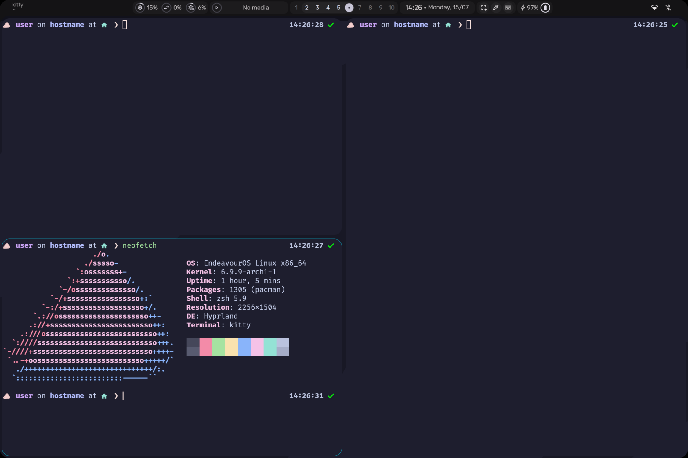
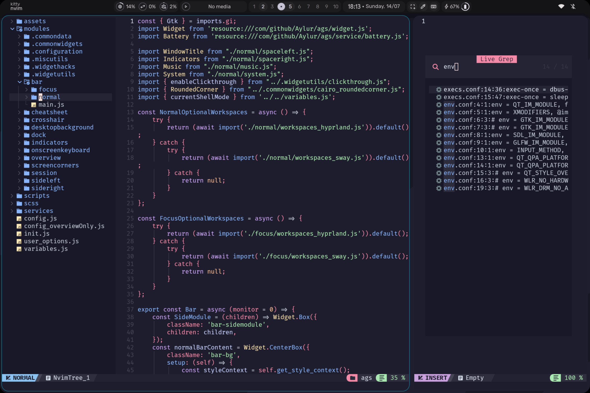
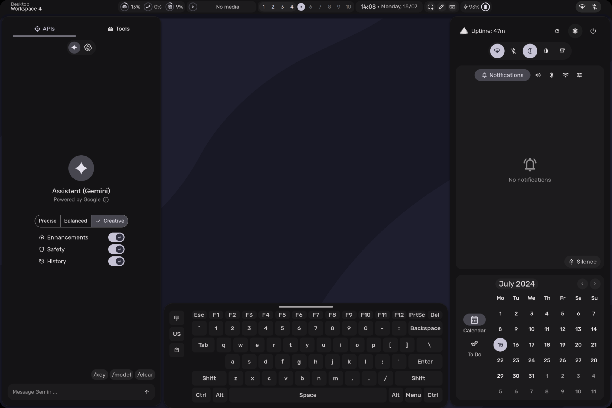
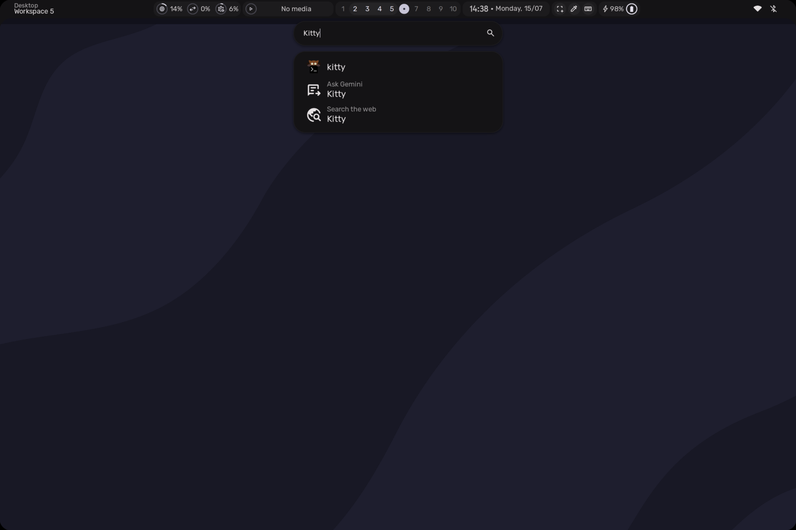
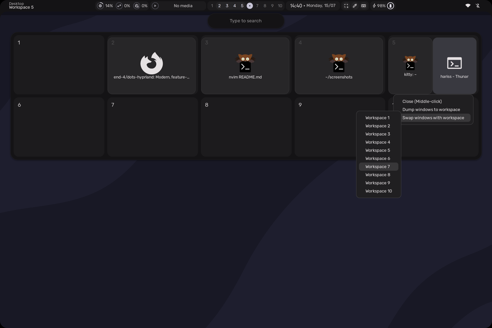

# My Personal Setup

Inspired by [end_4's Hyprland dotfiles](https://github.com/end-4/dots-hyprland) and [MathisP75's hyppuccin](https://github.com/MathisP75/hyppuccin/)

- OS: [EndeavourOS](https://endeavouros.com/)
- Compositor: [Hyprland](https://hyprland.org/)
- Terminal: [kitty](https://sw.kovidgoyal.net/kitty/)
- Shell: [Zsh](https://www.zsh.org/)
- Text editor: [neovim](https://neovim.io/)
- Cursor theme: [Bibata Modern Classic](https://github.com/ful1e5/Bibata_Cursor)
- PDF viewer: [Zathura](https://pwmt.org/projects/zathura/)
- Widgets: [AGS](https://aylur.github.io/ags-docs/)
- GUI file manager: [Thunar](https://docs.xfce.org/xfce/thunar/start)
- Color scheme/theme: [Cattpuccin](https://catppuccin.com/)

